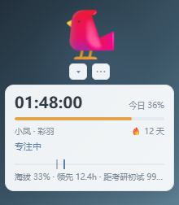
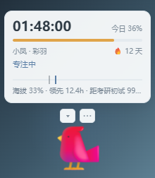
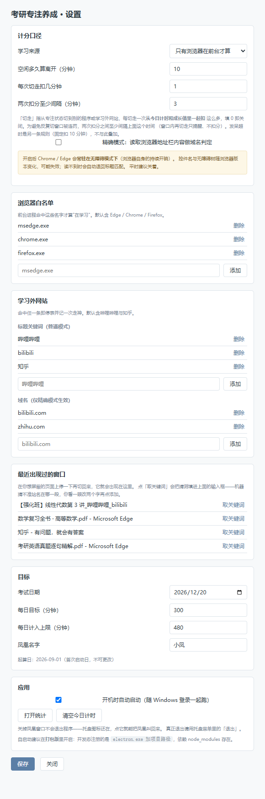
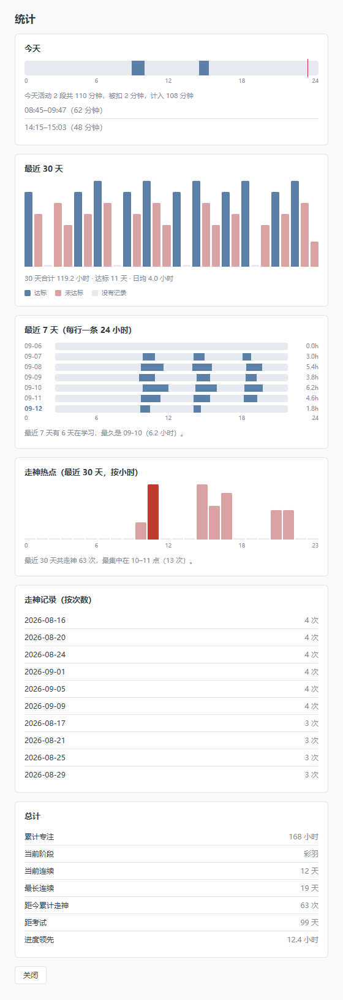

# 考研专注养成

> 一只浮在桌面上的凤凰。你在浏览器里读 PDF，它就长大；你切到 B 站或知乎，它就打盹。
> 山巅是你设定的目标那天，海拔是你攒下的专注。

> 虽然叫"考研"，但**目标完全可自定义**——期末考、项目截止、任何有截止日、你希望在此之前
> 持续投入的事都行。名称与日期都在设置里改。

<p align="center">
  
  &nbsp;&nbsp;
  
  &nbsp;&nbsp;
  
</p>

<p align="center">
  <sub>默认（面板在蛋下方）· 靠近屏幕底部时自动翻到上方 · 收起后只剩状态圆点与今日计时</sub>
</p>

## 下载

去 [Releases](../../releases/latest) 下载 `KaoyanFocusCompanion-v*-win32-x64.zip`，解压后双击 `KaoyanFocusCompanion.exe`。

绿色版：不写注册表、不装服务，卸载就是删掉文件夹。首次启动会自动打开设置页，
填上考试日期与每日目标即可。

> Windows 可能弹 SmartScreen 提示（未签名），点「更多信息 → 仍要运行」。

## 它解决什么

备考时的主要动作是**在浏览器里看 PDF**，而走神有四种形态：切到别的网页、拿起手机、
发呆、坐不住不想开始。

市面上的工具大多走"硬拦截"——直接封掉娱乐网站。但那类工具的通病是：**它只会拦，不会回应**。
你被拦了十次，除了烦躁什么也没得到。这个项目换了个方向：

- **不拦你，但让你看见代价**。切走一次，凤凰缩一下、飘出「扣 1 分钟」，今日计时真的往下掉。
- **把长期目标拆成看得见的成长**。考研的回报在几个月后，太远；凤凰的阶段在几天内就能变。
- **测量必须诚实**。挂着 PDF 人跑了不算数——否则养成就是假的，两三天你就不会信它了。

## 界面

### 设置



### 统计



## 功能

### 诚实计时

三条**同时满足**才走表：

| 条件 | 说明 |
|---|---|
| 前台窗口是"学习来源" | 默认只有浏览器（`msedge.exe` / `chrome.exe` / `firefox.exe`）算；也可切成"任何窗口都算" |
| 当前内容不属于"学习外" | 命中名单就停表并记一次走神 |
| 10 分钟内动过鼠标键盘 | 防止"挂着 PDF 人跑了" |

判定分三层，按精度递降，读不到就退到下一层：

1. **URL 层**（可选，精确模式）：通过 UI Automation 读浏览器地址栏，做域名级判定
2. **标题层**（默认）：匹配窗口标题关键词，默认内置 `哔哩哔哩` / `bilibili` / `知乎`
3. **进程层**：只判断前台进程是不是浏览器

### 三条惩罚（都可配）

| 触发 | 扣多少 | 可调 |
|---|---|---|
| 从专注状态切走 | 1 分钟（**3 分钟内只扣一次**，避免反复切窗口被连罚） | 额度、间隔都可改，填 0 关闭 |
| 发呆超时（10 分钟无操作） | 10 分钟 | 阈值可改 |
| 切到学习外网站 | 记一次走神 | 名单可增删 |

扣分**同时打在今日计时和成长值上**。只扣成长值的话，你盯着的那行大字（今日计时）纹丝不动，
感觉就像什么都没发生——惩罚也就失去了意义。

被节流时飘字是「又切走了」而**不是**「扣 1 分钟」：没扣就不能说扣了，骗人的提示下次就没人信。

### 养成

**凤凰 12 阶段**，形象随阶段变化，不是同一个图标变色：

| # | 阶段 | 累计专注 | # | 阶段 | 累计专注 |
|---|---|---|---|---|---|
| 1 | 蛋 | 0 小时 | 7 | 彩羽 | 44 小时 |
| 2 | 裂纹蛋 | 0.5 小时 | 8 | 灵鸟 | 70 小时 |
| 3 | 雏鸟 | 2 小时 | 9 | 火羽鸟 | 105 小时 |
| 4 | 幼鸟 | 6 小时 | 10 | 半凰 | 150 小时 |
| 5 | 学飞 | 14 小时 | 11 | 火凰 | 210 小时 |
| 6 | 飞鸟 | 26 小时 | 12 | 凤凰 | 300 小时 |

**山**：山巅是目标那一天。你的海拔 = 累计专注 ÷（剩余天数 × 每日目标），
再与"时间进度"对比，得出领先或欠账多少小时。所以山不是装饰，它每天回答"我进度够不够"。

目标**不一定是考研**——期末考、项目截止、任何有截止日、你希望在此之前持续投入的事都行。
名称和日期都可自定义，桌宠上会显示成「距考研初赛 99 天」这样。

**精神值**：今日状态，0–100。专注时缓慢回升，超时与走神时下降，只影响凤凰当天的神态，不影响阶段。

**连续天数**：达标日 = 当日计入时长够每日目标。每月给 2 张补签卡，避免一次意外全盘归零。

### 反馈

只扣数字是"安静"的惩罚——感觉不到就改不掉。所以每个事件在发生的那一秒都有视觉响应：

| 事件 | 凤凰的动作 | 飘字 |
|---|---|---|
| 切走 | 缩一下 | 琥珀色「切走了 · 扣 N 分钟」 |
| 发呆超时 | 缩一下 + 扩散环 | 红色「发呆超时 · 扣 10 分钟」 |
| 切到学习外网站 | 摇头 | 「走神 +1」 |
| 回到专注 | 弹一下 | 绿色「回来了」 |
| 进化 / 达标 | 弹跳 + 扩散光环 | 绿色「进化 · 飞鸟」 |
| 窗口内重复切走 | 轻度摇头 | 灰色「又切走了」（不声称扣分） |

收起成一条药丸时，状态圆点也会闪——不会因为面板收起来就丢了反馈。

### 统计

- **今天**：24 小时时间轴，画出每一段专注，标出当前时刻，并说明"活动多久、被扣多少、计入多少"
- **最近 30 天**：每日时长柱状图，达标 / 未达标 / 无记录三色区分
- **最近 7 天**：每天一条 24 小时轨道并排——单看一天看不出作息规律，一周并排才能看出哪天在划水
- **走神热点**：按小时聚合，标出峰值时段。"今天走神 5 次"没有行动价值，"每天下午三点必走神"才有
- **总计**：累计专注、当前阶段、当前与最长连续、距考试、进度领先/欠账

### 托盘与自启动

- 托盘菜单：暂停计时 / 显示隐藏凤凰 / 设置 / 统计 / 开机自启动 / 退出
- **关掉凤凰窗口不会退出程序**，托盘图标还在，点它就能把凤凰叫回来；退出请用托盘菜单
- 开机自启动随 Windows 登录启动
- 单实例锁：重复启动只会把已有的凤凰叫到前面来

## 怎么用

| 操作 | 效果 |
|---|---|
| 按住凤凰拖动 | 移动位置（位置会记住） |
| 点 `▾` | 收起 / 展开信息面板 |
| 点 `⋯` | 打开菜单（暂停 / 设置 / 统计 / 退出） |
| 把蛋放到屏幕底部再展开 | 面板自动翻到蛋的**上方**，且蛋停在原地不动——不会为了腾地方而跳一下 |
| 拖到副屏后拔掉显示器 | 下次启动会自动挪回主屏，不会"找不回来" |

## 从源码运行 / 打包

```bash
cd desktop
npm install          # 从 npmmirror 拉 Electron 二进制（见 .npmrc）
npm start            # 开发态运行
npm run package      # 打包到 desktop/dist/，可脱离开发环境运行
npm run screenshots  # 重新生成 README 里的界面截图
```

在仓库根目录：

```bash
npm test             # 全部单元测试
```

## 设计上的四条硬约束

这个项目最初是浏览器扩展，后来整个推倒重做成原生桌宠，都是被下面这些逼的：

**1. 内容脚本注不进 Edge 自带的 PDF 查看器。**
在网页 DOM 里浮一个可拖动的元素——这条路在你最需要它的那个页面上（本地 PDF）完全不可见。
画中画方案能浮在 PDF 上，但窗口的标题栏与工具栏由浏览器绘制，CSS 碰不到，做不出桌宠的观感。

**2. Electron 没有读前台窗口的 API。**
原生 Node addon 要 node-gyp + MSVC 编译链；PowerShell 的 `Add-Type` 直接 P/Invoke Win32，
零编译依赖，且实测能正确读出中文窗口标题与系统空闲时长。探针每 1 秒产出一行 JSON，
**只读**——不发送输入、不修改系统设置。崩了会按指数退避自动重启，连败 3 次弹托盘气泡告知：
这个工具最糟的失败方式是静默失效，计时停了而你毫不知情，还以为自己在学。

**3. 精确模式有真实代价。**
UI Automation 能精确读到地址栏，但会让 Edge / Chrome **常驻在无障碍模式下**
（浏览器自身的持续开销），且控件名与无障碍树结构随浏览器版本变化。所以默认用标题，
精确模式做成可选开关，读不到自动回退。

**4. 必须显式忽略自身进程。**
拖动或点击桌宠时前台会变成它自己。不忽略的话，你每摸一下宠物，学习时间就断一次。
名单必须**运行时**并入 `path.basename(process.execPath)`——开发态是 `electron.exe`、
打包后是 `KaoyanFocusCompanion.exe`，写死必然漏一个（这个 bug 真的发生过，
现在有专门的回归测试锁着它）。

## 目录结构

```
src/core/      共享纯逻辑：时间切分、会话状态机、账户结算、成长与山（无 Electron 依赖）
src/lib/       共享纯逻辑：设置归一化、存储封装、快照组装
desktop/       桌宠本体（Electron）
  main.js        主进程：窗口、托盘、计时循环、IPC、自启动
  src/*.mjs      可单测的纯逻辑：判定分层、文件存储、探针、样本映射、时段、反馈、自身识别、位置校正
  native/        PowerShell 探针（只读 Win32 / UI Automation）
  pet/ settings/ stats/   三个界面
  scripts/       图标生成、界面截图
extension/     已退役的浏览器扩展形态（保留作参考）
test/ desktop/test/       单元测试
```

## 数据

存在 Electron 的 userData 目录（`%APPDATA%\kaoyan-focus-companion-desktop\`）：

- `kaoyan-focus-state.json` — 全部状态与历史
- `kaoyan-focus.log` — 排错日志

**没有账号、不联网、不上传任何数据。**

## 测试

```bash
npm test
```

299 个用例，覆盖共享核心、判定分层、文件存储、探针解析、样本映射、时段合并与跨天切分、
反馈推导、自身进程识别、窗口位置校正。纯逻辑与浏览器 API 严格分离，所以都能在 node 下直接跑。

## 已知限制

- 学习外判定在默认模式下靠窗口标题关键词，小众站点标题里若不含站名就认不出（可用精确模式或手动加关键词）
- 精确模式尚未在真实浏览器上长期验证
- 手指离开鼠标超过 10 分钟会按"发呆"处理；深度阅读若长时间不触碰键鼠，可能被误判
- 手机分心是桌宠覆盖不到的部分
- 打包产物未签名

## 路线

- [ ] 精确模式的真机验证
- [ ] 走神热点与专注时段的交叉分析（"走神前你在读什么"）
- [ ] 周报
